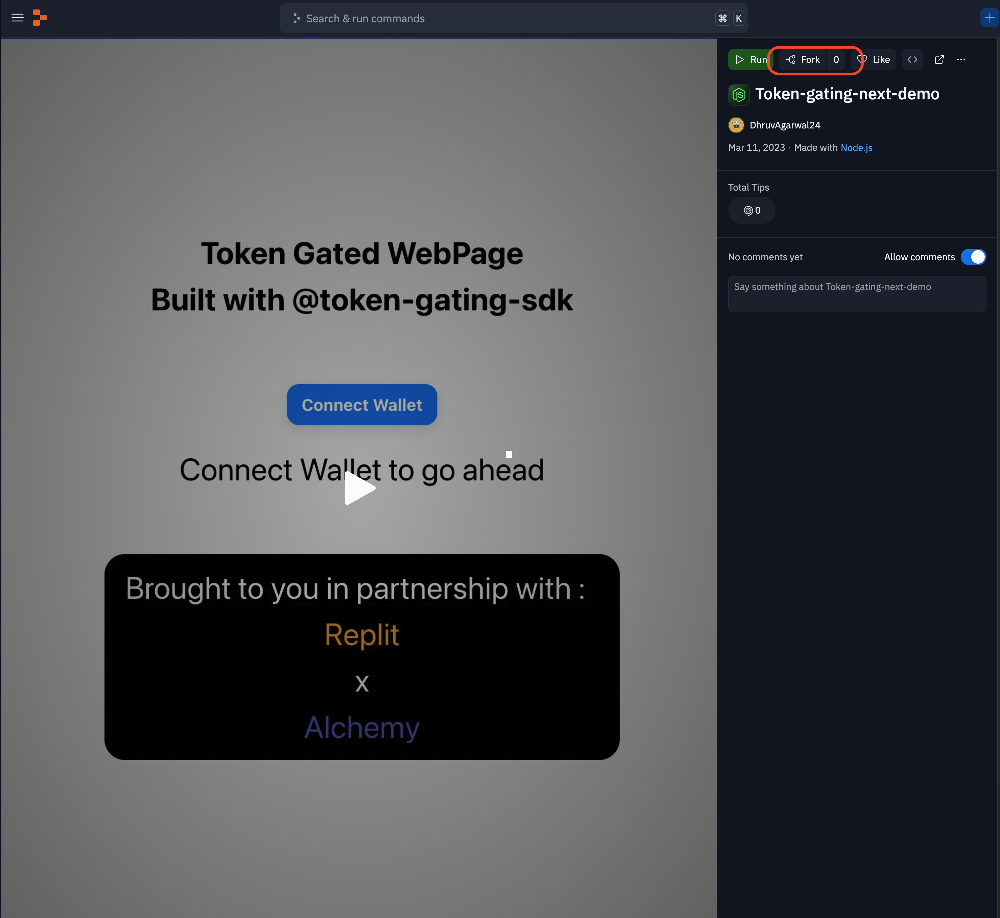
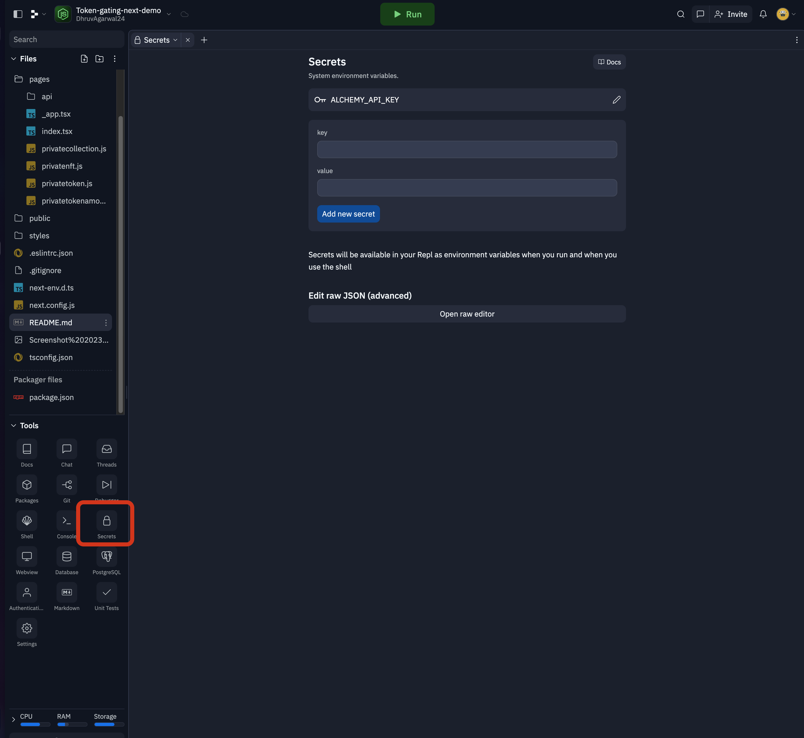

# Token-Gating-Replit-Template

This is Replit Template for the Next.js implementation of Token-gating-SDK in typescript. It can be forked to fire up a REPL with token-gating implemented and can be customized and configure according to your needs.

## Guide to use the Template

1 . Fork the Replit from the template page

2 . Then REPL will start up and dependencies will be installed , if they don't , use `npm install` to do so.

3 . Now the main step is to configure , go to `config/config.ts`. You can customize it according to the settings you want to , pages and conditions. [Click here for a detailed guide](https://github.com/Dhruv-2003/token-gating-tool#how-to-create-the-config-file-)

I have added a demo Config file & pages which can be replaced and deleted.

4 . Last thing is to add `ALCHEMY_API_KEY`. Go to Secrets under Tools , add a new environment variable named `ALCHEMY_API_KEY` and the value as the API key.

Get an API key from [Alchemy](https://dashboard.alchemy.com/signup/?a=f8afc2202c)

Andd!! The REPL is good to go , it is token gated now 

## Appendix

The main SDK can be found here on replit : [SDK-REPL](https://replit.com/@DhruvAgarwal24/token-gating-tool?v=1)

The package can be found on npm : [npm-sdk](https://www.npmjs.com/package/token-gating-sdk)

The code on github is : [github-sdk](https://github.com/Dhruv-2003/token-gating-tool)

## Acknowledgements

Build in partnership with `Alchemy` X `Replit`

## Contact

For any queries , you can raise an issue on github or reach out me at : contact.dhruvagarwal@gmail.com